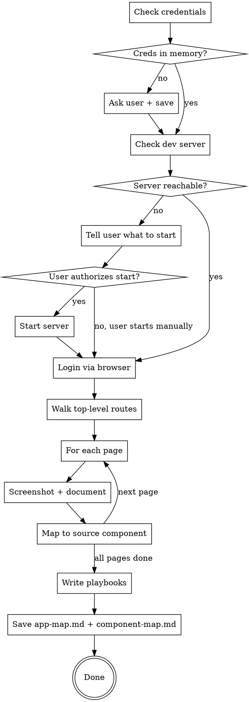

# App Navigator

Map your application's UI and build reusable Playwright playbooks for browser-based testing and verification.

**Core principle:** Know your app before you test it. This skill creates a living knowledge base of routes, pages, components, and interactions that other skills (like trust-but-verify) build on.

## When to Use

- Setting up browser-based testing for the first time in a project
- After significant UI changes that may have shifted routes or layouts
- Before running trust-but-verify, if no app-map.md exists yet
- When you need to understand the app's page structure

**Not for:** API-only projects, backend-only changes, or projects without a web UI.

## Invocation

- `/app-navigator setup` -- map the app and write playbooks
- `/app-navigator audit` -- UI/UX audit (v2, not yet implemented)
- If no argument given and no `app-map.md` exists, runs setup mode automatically

## Setup Mode Process



### Step 1: Credential Check

Read the memory file at `~/.claude/projects/<project>/memory/reference_local_auth.md`.

If it exists, extract: Email, Password, App URL, Login path.

If it does NOT exist, ask the user:
> "I need login credentials for the local dev environment. Please provide:
> 1. Email address
> 2. Password
> 3. App URL (default: http://localhost:5173)
> 4. Login path (default: /login)
>
> These will be saved to your project memory for future use."

Save their response to `~/.claude/projects/<project>/memory/reference_local_auth.md`:

```
---
name: local-auth-credentials
description: Local dev login credentials and app URL for Playwright verification
type: reference
---

- Email: <user-provided>
- Password: <user-provided>
- App URL: <user-provided, default http://localhost:5173>
- Login path: <user-provided, default /login>
```

Update `MEMORY.md` with a pointer to this file.

### Step 2: Preflight -- Dev Server Check

Run:
```bash
curl -s -o /dev/null -w "%{http_code}" <App URL> 2>/dev/null || echo "unreachable"
```

If unreachable, tell the user:
> "The dev server at <App URL> isn't reachable. You'll need to start it.
> Start your development server (e.g., `npm run dev`, `pnpm run dev`).
> Start your API server if needed.
>
> Want me to start it for you, or will you handle it?"

If user authorizes, start the server. Otherwise, wait for user confirmation that it's running, then re-check.

### Step 3: Login via Browser

Use Playwright MCP tools:

1. `mcp__playwright__browser_navigate` to `<App URL><Login path>`
2. `mcp__playwright__browser_snapshot` to see the login form
3. `mcp__playwright__browser_fill_form` with email and password fields
4. `mcp__playwright__browser_click` on the submit/login button
5. `mcp__playwright__browser_wait_for` with `text` set to a known post-login element (e.g., a dashboard heading or username)
6. `mcp__playwright__browser_snapshot` to confirm logged-in state

If the page redirects through an SSO/OAuth provider or shows an organization selector, follow the redirects and select the first organization.

If login fails, ask the user to verify credentials and update the memory file.

### Step 4: Navigate & Map

For each top-level navigation route (sidebar items, nav bar links):

1. `mcp__playwright__browser_click` on the nav item
2. `mcp__playwright__browser_wait_for` with `text` set to a key element on the target page
3. `mcp__playwright__browser_snapshot` to capture the page structure
4. `mcp__playwright__browser_take_screenshot` with `filename` set to an absolute path (resolve `~` via `echo $HOME` first), e.g., `/Users/<user>/.claude/skills/app-navigator/screenshots/<page-slug>.png`
5. Record: URL, page title, key elements visible, available interactions

To map to source components, dispatch a subagent with the `setup-prompt.md` template, providing the list of discovered routes. The subagent uses `Grep` and `Glob` to search `src/` for route definitions and component files.

### Step 5: Write Playbooks

Write three markdown playbooks based on what was discovered:

**`playbooks/auth.md`** -- Document the exact MCP tool call sequence to log in:
- Which URL to navigate to
- Which form fields exist (their `ref` values from snapshots)
- What to fill in each field
- Which button to click
- What to wait for after submission (specific text)
- How to handle SSO/OAuth redirects or org selector if present

**`playbooks/navigation.md`** -- For each mapped page:
- The nav element to click (with `ref` or text description)
- The URL it navigates to
- What text to wait for to confirm the page loaded
- Key landmark elements on the page

**`playbooks/interactions.md`** -- Common interaction patterns discovered:
- How to open modals (which buttons trigger them)
- How to fill forms (common form patterns)
- How to create/delete items
- How to use dropdowns, date pickers, etc.

### Step 6: Save Documentation

Write `app-map.md` with this structure:

```
# App Map

**Generated:** YYYY-MM-DD
**App URL:** <url>

## Routes

### [Page Name]
- **URL:** /path
- **Purpose:** What this page does
- **Key Elements:** List of important UI elements
- **Interactions:** What you can do on this page
- **Screenshot:** ./screenshots/<page-slug>.png
- **Source Component:** src/path/to/Component.tsx
```

Write `component-map.md`:

```
# Component Map

| Route | URL | Component | File |
|-------|-----|-----------|------|
| Page Name | /path | ComponentName | src/path.tsx |
```

### Cleanup

After all mapping is complete, close the browser with `mcp__playwright__browser_close`.

## Red Flags

- **Never hardcode credentials** in SKILL.md or playbooks. Always read from memory.
- **Never run services without asking.** Check first, ask permission, then start.
- **Don't map parametric sub-pages** (like /users/:id). Stick to top-level nav routes.
- **Don't screenshot behind auth walls you can't pass.** If a page requires special permissions, note it and skip.

## After Setup: What's Next

When setup completes, print a summary of what was created, then offer:

> **Ready to verify a feature branch?** Run `/trust-but-verify` to check that your UI implementation matches the plan. It uses the app map and playbooks you just created to:
> 1. Read your ExecPlan + git diff + PR description
> 2. Build a verification checklist of what to test
> 3. Login and navigate the app with Playwright
> 4. Test happy paths, edge cases, error states, and responsive layouts
> 5. Produce a report at `docs/verification/` with findings and screenshots
>
> You can run it anytime on any feature branch. Type `/trust-but-verify` to start.

If the user says yes, invoke the trust-but-verify skill.

## Integration

- **Used by:** trust-but-verify (reads app-map.md and playbooks)
- **Credentials shared with:** Any skill that reads `reference_local_auth.md` from memory
