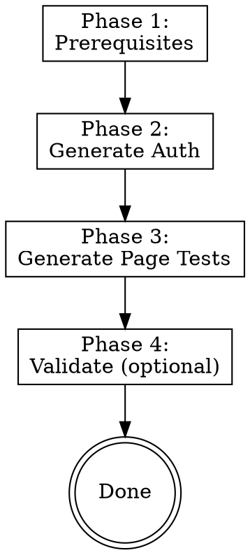

# Generate Tests

Generate reusable Playwright `.spec.ts` test files from your app-navigator map and playbooks.

**Core principle:** Mapped knowledge should produce executable tests. This skill reads what app-navigator discovered and writes a test suite that lives in your repo and runs with `npx playwright test`.

## When to Use

- After running `/app-navigator setup` and you want persistent, rerunnable tests
- When you need a baseline test suite for CI
- When trust-but-verify reveals gaps that should be codified as assertions
- When recommended by app-navigator or trust-but-verify

**Not for:** Backend/API tests, replacing hand-written integration tests, or one-shot verification (use trust-but-verify for that).

## Invocation

- `/generate-tests` — generates smoke-depth tests (default)
- `/generate-tests --depth functional` — smoke + interaction tests
- `/generate-tests --depth full` — functional + edge cases + responsive

## Process



### Phase 1: Prerequisites

1. **App map:** Check `~/.claude/skills/app-navigator/app-map.md` exists
   - If no: "Run `/app-navigator setup` first — I need the app map to generate tests." Offer to invoke it.

2. **Playwright installed:** Check if `@playwright/test` is in root `package.json` devDependencies
   - If no: run `pnpm add -D -w @playwright/test` and `npx playwright install chromium`

3. **Config:** Check if `playwright.config.ts` exists in the project root
   - If no: scaffold one with this template:

```typescript
import { defineConfig, devices } from '@playwright/test';
import dotenv from 'dotenv';

dotenv.config({ path: '.env.test.local' });

export default defineConfig({
  testDir: './tests/e2e',
  timeout: 30_000,
  expect: { timeout: 10_000 },
  fullyParallel: true,
  retries: 1,
  use: {
    baseURL: process.env.BB_TEST_BASE_URL || 'http://localhost:5173',
    trace: 'on-first-retry',
  },
  projects: [
    { name: 'setup', testMatch: /auth\.setup\.ts/, teardown: undefined },
    {
      name: 'chromium',
      use: {
        ...devices['Desktop Chrome'],
        storageState: 'tests/e2e/.auth/user.json',
      },
      dependencies: ['setup'],
    },
  ],
});
```

4. **Directories:** Create `tests/e2e/` and `tests/e2e/.auth/` if they don't exist

5. **Gitignore:** Add `tests/e2e/.auth/` and `.env.test.local` to `.gitignore` if not present

### Phase 2: Generate Auth Setup

Read:
- `~/.claude/skills/app-navigator/playbooks/auth.md` for the login flow
- `~/.claude/projects/<project>/memory/reference_local_auth.md` for credentials

**Create `.env.test.local`** (gitignored) from memory credentials:
```
BB_TEST_EMAIL=<email from memory>
BB_TEST_PASSWORD=<password from memory>
BB_TEST_BASE_URL=<app URL from memory, default http://localhost:5173>
```

**Generate `tests/e2e/auth.setup.ts`:**
- Read `BB_TEST_EMAIL` and `BB_TEST_PASSWORD` from `process.env`
- Navigate to the login URL (e.g., `http://localhost:5173/login`)
- Follow the SSO/OAuth redirect to the auth domain
- Fill the email and password fields on the login form
- Click the submit/login button
- Wait for redirect through the OAuth callback path (e.g., `/auth/callback`) back to the app domain
- If an org selector appears: select the first org or one matching `BB_TEST_ORG` env var
- Save `storageState` to `tests/e2e/.auth/user.json`

The auth setup captures cookies from all domains visited (app + auth), which preserves the auth session across tests.

**Important:** The exact login flow (field names, redirect chain, org selector) comes from `playbooks/auth.md`. Read it carefully — don't assume a generic login form.

### Phase 3: Generate Page Tests

Read:
- `~/.claude/skills/app-navigator/app-map.md` — routes, key elements, interactions
- `~/.claude/skills/app-navigator/playbooks/navigation.md` — how to navigate
- `~/.claude/skills/app-navigator/playbooks/interactions.md` — common UI patterns

For each route in the app map, generate `tests/e2e/<page-slug>.spec.ts`.

**Every generated file starts with:**
```typescript
// AUTO-GENERATED by generate-tests skill from app-navigator map
// Regenerate with: /generate-tests --depth <level>
// Last generated: YYYY-MM-DD
```

**Depth: smoke (default)**
```typescript
test.describe('Page Name', () => {
  test('page loads', async ({ page }) => {
    await page.goto('/route');
    await expect(page.locator('text=Expected Heading')).toBeVisible();
  });

  test('key elements present', async ({ page }) => {
    await page.goto('/route');
    // Assert 2-3 key elements from app-map "Key Elements" field
    await expect(page.getByRole('button', { name: 'Create' })).toBeVisible();
  });
});
```

**Depth: functional** — adds interaction tests:
```typescript
  test('create button opens dropdown', async ({ page }) => {
    await page.goto('/route');
    await page.getByRole('button', { name: 'Create' }).click();
    await expect(page.getByText('Create Document')).toBeVisible();
  });
```

**Depth: full** — adds edge cases + responsive:
```typescript
  test('responsive: mobile layout', async ({ page }) => {
    await page.setViewportSize({ width: 375, height: 812 });
    await page.goto('/route');
    await expect(page.locator('text=Expected Heading')).toBeVisible();
  });
```

**Test conventions:**
- Tests grouped by depth with comments: `// --- SMOKE ---`, `// --- FUNCTIONAL ---`, `// --- FULL ---`
- All tests reuse `storageState` from the setup project — no re-login
- Selectors use `getByRole`, `getByText`, `getByLabel` — resilient to DOM changes
- Each test is independent — no ordering dependencies
- Routes sharing a component (e.g., tracked items) are grouped in one file
- Settings sub-pages are included in `settings.spec.ts`

### Phase 4: Validate (optional)

After generating, offer:
> "Tests generated. Want me to run them to make sure they pass?"

If yes:
1. Check dev server is reachable
2. Run `npx playwright test`
3. If tests fail: read the error, fix the test (adjust selector/wait/assertion), re-run. Max 3 fix iterations per test, then skip with a note.
4. Report: X/Y tests passing, Z skipped with reasons

If no: files are ready. Do NOT auto-commit — let the user decide.

## Regeneration

Running `/generate-tests` again overwrites all files with the `AUTO-GENERATED` header. Hand-written test files without the header are NOT touched.

## Red Flags

- **Never hardcode credentials** in test files. Always use env vars.
- **Never commit `.env.test.local`** — it contains real credentials.
- **Never auto-commit** generated tests. Let the user review and commit.
- **Don't generate tests without an app-map.** The map is the source of truth.
- **Don't invent selectors.** Every element name and assertion comes from the app-map.

## After Generation

> "Tests generated at `tests/e2e/`. Run them with `npx playwright test`.
>
> Want to verify your current feature branch against its plan? Run `/trust-but-verify`."

If the user says yes, invoke the trust-but-verify skill.

## Integration

- **Depends on:** app-navigator (reads app-map.md and playbooks)
- **Credential source:** `reference_local_auth.md` in project memory → `.env.test.local`
- **Recommended by:** app-navigator (after setup), trust-but-verify (if no tests exist)
- **Recommends:** trust-but-verify (after generation)
