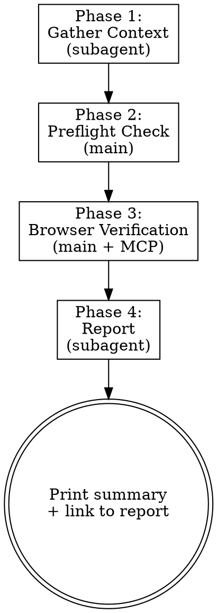

# Trust But Verify

Verify that a feature implementation actually matches its plan by testing it in a real browser.

**Core principle:** Plans describe intent. Code describes implementation. Only the browser shows reality. This skill bridges all three — reading the plan, analyzing the diff, and verifying the result in a live browser.

## When to Use

- After completing a feature branch and before merging
- When a plan exists in `docs/plans/` for the current work
- When the diff touches frontend source files (UI changes)
- When you want confidence that the UI matches the spec
- When recommended by `superpowers:finishing-a-development-branch`

**Not for:** Backend-only changes, API-only work, or branches without a plan.

## Process



### Phase 0: Check for App Navigator

Before starting, check if `~/.claude/skills/app-navigator/app-map.md` exists.

**If it does NOT exist:**
> "I notice the app hasn't been mapped yet. Running `/app-navigator setup` first will map all your routes, build login playbooks, and document UI patterns — which makes verification much faster and more accurate.
>
> Would you like to run `/app-navigator setup` first, or proceed without it?"

If the user says yes, invoke the app-navigator skill. When it completes, continue to Phase 1.
If the user says no, proceed without it — Phase 1 will derive pages from the plan and diff only.

**If it exists:** proceed to Phase 1.

### Phase 1: Gather Context

Dispatch a subagent (type: `general-purpose`) with the prompt template from `./analysis-prompt.md`.

The subagent reads:
- The ExecPlan from `docs/plans/` (find the most recent plan matching the branch name or topic)
- `git diff main...HEAD` to see what files changed
- `gh pr view` to get PR description (if a PR exists)
- `~/.claude/skills/app-navigator/app-map.md` (if it exists)
- `~/.claude/skills/app-navigator/playbooks/` (if they exist)

The subagent returns a **verification checklist** — a structured markdown document listing:
- Pages/routes to visit
- UI elements to verify on each page
- Happy path interactions to perform
- Edge cases to test
- Error states to trigger
- Responsive checks needed (only for pages in the diff)

### Phase 2: Preflight Check

**App URL:** Read `~/.claude/projects/<project>/memory/reference_local_auth.md`.
- If found: extract the App URL
- If not found: ask the user for the local app URL (e.g. `http://localhost:5173`), save it

**Dev server:** Check if the app is reachable:
```bash
curl -s -o /dev/null -w "%{http_code}" <App URL> 2>/dev/null || echo "unreachable"
```

If unreachable:
> "The dev server at <App URL> isn't reachable. You'll need to start it.
> Want me to start it, or will you handle it?"

**Setup:** Create the verification output directory:
```bash
mkdir -p docs/verification
```

**Gate:** Do not proceed to Phase 3 until the server is confirmed reachable.

### Phase 3: Browser Verification

**Initial Load & Authentication:**
1. Navigate to the App URL with `mcp__playwright__browser_navigate`
2. `mcp__playwright__browser_snapshot` to see what's on screen
3. **If there's a login form:** ask the user for credentials (email/password), fill the form, submit, wait for redirect. Save credentials to `reference_local_auth.md` for future runs.
4. **If there's a workspace/org selector or first-run setup:** handle it (select first option or ask user which to pick)
5. **If the app loads directly:** proceed — no auth needed
6. If login fails or redirects back to login: ask user to verify credentials
7. On future runs, if `reference_local_auth.md` has saved credentials, use them automatically. Only ask the user again if they fail.

**For each checklist item:**

1. Navigate to the target page
   - Use `mcp__playwright__browser_navigate` with the full URL
   - `mcp__playwright__browser_wait_for` with `text` set to a known element on the target page
   - If page doesn't load in 30 seconds: record FAIL, move to next item

2. Verify elements
   - `mcp__playwright__browser_snapshot` to get the page structure
   - Check each expected element from the checklist against the snapshot
   - Record PASS/FAIL for each element

3. Happy path interactions
   - Follow the checklist's step-by-step interaction sequence
   - Use `mcp__playwright__browser_click`, `browser_fill_form`, `browser_type`, `browser_select_option` as needed
   - After each interaction, `browser_snapshot` to verify the expected outcome
   - Record PASS/FAIL/CONCERN for each interaction

4. Edge cases and error states
   - Follow the checklist's edge case scenarios
   - Test empty states, invalid input, boundary values
   - Record results

5. Responsive checks (only for pages that changed in the diff)
   - `mcp__playwright__browser_resize` to 1440x900 (desktop) -- screenshot
   - `mcp__playwright__browser_resize` to 768x1024 (tablet) -- screenshot
   - `mcp__playwright__browser_resize` to 375x812 (mobile) -- screenshot
   - Record any layout issues
   - `mcp__playwright__browser_resize` to 1440x900 (reset to desktop before next item)

6. Screenshots
   - `mcp__playwright__browser_take_screenshot` at key states
   - Save to `docs/verification/screenshots/<branch>/` with naming: `<page-slug>-<state>-<viewport>.png`
   - Create the directory if it doesn't exist:
     ```bash
     mkdir -p docs/verification/screenshots/<branch>
     ```

7. Session handling
   - If any page redirects to login: re-authenticate using the same login flow, then resume from the current checklist item

**Collect all results** as structured markdown to pass to Phase 4.

### Phase 4: Report

Dispatch a subagent (type: `general-purpose`) with the prompt template from `./report-prompt.md`.

Pass the subagent:
- The verification results markdown from Phase 3
- The original plan reference
- Screenshot file paths
- Branch name and PR link (if any)

The subagent writes the full report to `docs/verification/YYYY-MM-DD-<branch-slug>.md` (where `<branch-slug>` is the branch name with `/` replaced by `-`) and returns a concise summary.

**Print the summary** in conversation. Include:
- The summary counts (PASS/CONCERN/FAIL/OUT-OF-SCOPE)
- Any FAIL items with one-line descriptions
- Link to the full report file

**Cleanup:** Close the browser session with `mcp__playwright__browser_close`.

## Report Format

The full report follows this structure:

```markdown
# Verification Report: <branch-name>
**Date:** YYYY-MM-DD
**Plan:** <link to ExecPlan>
**PR:** <link if exists>
**Branch:** <branch> (N commits ahead of main)

## Summary
- X items verified and working
- X concerns noted
- X mismatches or failures
- X out-of-scope observations

## Detailed Findings

### Working as Expected
| Feature | Page | What was verified | Screenshot |
|---------|------|-------------------|------------|

### Mismatches / Broken
| Feature | Expected (from plan) | Actual | Severity | Screenshot |
|---------|---------------------|--------|----------|------------|

### Concerns
| Feature | Issue | Suggestion | Screenshot |
|---------|-------|------------|------------|

### Out of Scope
| Observation | Where | Notes |
|-------------|-------|-------|

## Edge Cases & Error States Tested
| Scenario | Result | Notes |
|----------|--------|-------|

## Responsive Checks
| Page | Desktop | Tablet | Mobile | Notes |
|------|---------|--------|--------|-------|
```

## Red Flags

- **Never skip the preflight check.** Always verify the server is reachable before browser work.
- **Never hardcode credentials.** Read from memory or ask the user.
- **Never modify code.** This skill only verifies -- it does not fix issues it finds.
- **Never run services without asking.** Check reachability first, ask permission.
- **Don't test pages unrelated to the plan.** Stay scoped to what changed.
- **Don't spend more than 30 seconds per interaction.** Record FAIL and move on.

## Integration

- **Depends on:** app-navigator (optional but recommended -- provides playbooks and app map)
- **Credential source:** Detected automatically from the browser. Saved to `reference_local_auth.md` in project memory after first successful login.
- **Recommended by:** superpowers:finishing-a-development-branch
- **Can be invoked after:** superpowers:executing-plans, superpowers:subagent-driven-development
